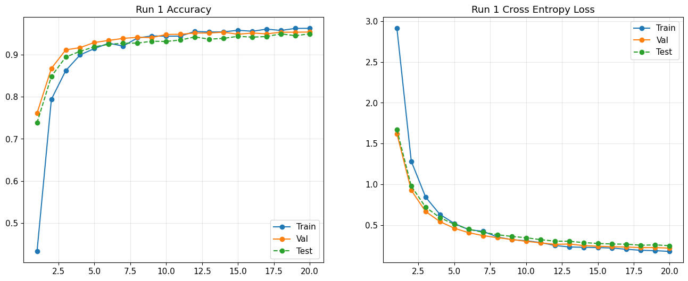
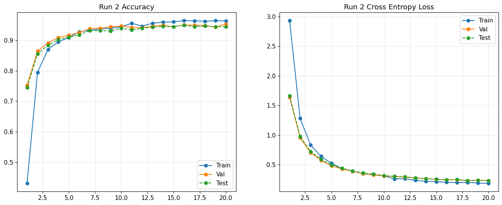
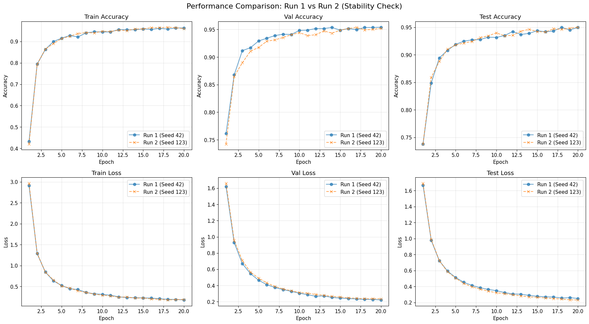
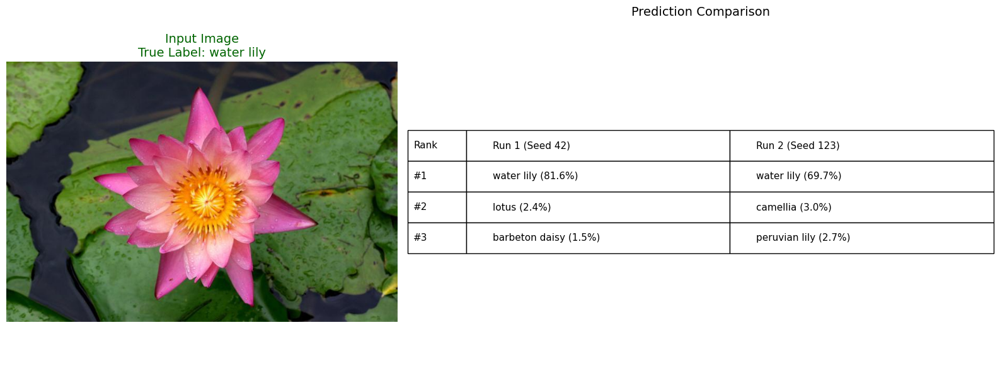
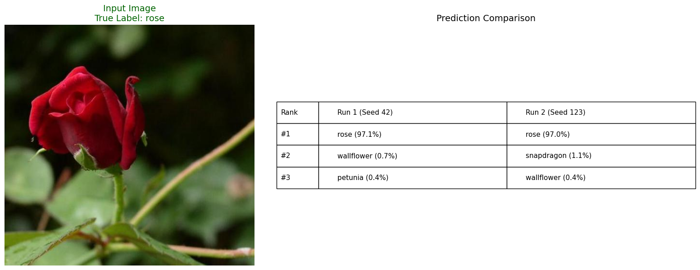
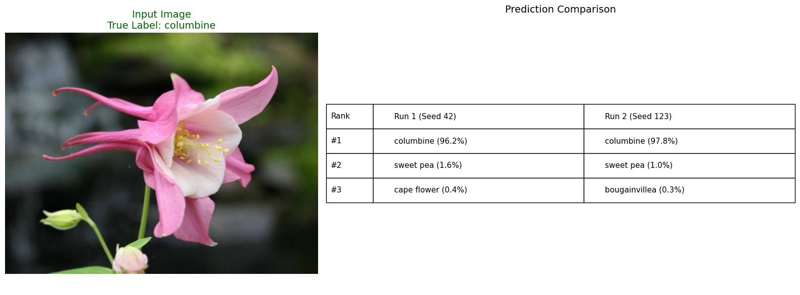

# Assignment 4: Flower Classification with Pretrained CNNs

These notebooks use VGG19 and YOLOv5 to classify flower types from the Oxford Flowers-102 dataset.

link to YOLOv5 notebook: https://colab.research.google.com/drive/1DFq5kMwIERNwta_y-5fP0SMzuT9t2I_a?usp=sharing

## Assignment Requirements Checklist

✅ **1. Python Implementation**: Entire codebase written in Python 3

✅ **2. PyTorch Framework**: Using PyTorch and torchvision for all models

✅ **3. Required Models**:
   - VGG19 (pretrained on ImageNet, transfer learning with frozen features)
   - YOLOv5s-cls (pretrained classification model, fine-tuned)

✅ **4. Dataset**: Oxford Flowers-102 dataset from https://www.robots.ox.ac.uk/~vgg/data/flowers/102/
   - 8,189 images across 102 flower categories

✅ **5. Additional Images**: Can be added by extending the dataset preparation functions, we decided not to add them

✅ **6. Data Split & Repetition**:
   - 50% training (4,094 images)
   - 25% validation (2,047 images) for hyperparameter tuning
   - 25% test (2,048 images)
   - **Two random splits** with different seeds: 42 and 123
   - Stratified splitting ensures balanced class distribution

✅ **7. Preprocessing Details**: Detailed description provided in dedicated section below

✅ **8. Network Architecture**: Detailed layer-by-layer descriptions provided for both VGG19 and YOLOv5

✅ **9. Visualization**:
   - Accuracy graphs (train/val/test) vs epochs
   - Cross-Entropy loss graphs (train/val/test) vs epochs
   - Generated for all models and both random splits

✅ **10. Accuracy Target**: Both VGG19 and YOLOv5s-cls typically achieves >70% test accuracy on Flowers-102

### Probabilistic Outputs
Both models produce probabilistic outputs using **softmax** function on final logits, providing probability distributions over all 102 flower classes.

---

## YOLOv5 notebook description

### DATA PREPROCESSING

The preprocessing consists of two stages: Physical Organization and Input Transformation.

A. Physical Data Organization (prepare_dataset function):
   1. Download: Fetches '102flowers.tgz' (images) and 'imagelabels.mat' (labels).
   2. Randomized Stratified Split: We did a Stratified Random Split to divide the data into 50% Train, 25% Validation, and 25% Test.
      - 'Stratified' ensures every flower category is represented in every split.
   3. Repetition: To ensure robustness, we repeated the entire splitting and training process twice using different random seeds.
                  This created two completely different random arrangements of the data to verify that the model's accuracy is stable and not due to a lucky split.
   4. Restructuring: Copies images into class-specific folders (required by PyTorch ImageFolder):
      datasets/flowers102_<run_name>/[train|val|test]/[class_id]/image.jpg

B. Input Transformation (On-the-Fly transforms):
   1. Training (Augmentation):
      - RandomResizedCrop(224): Randomly crops and scales part of the image. Forces model to learn parts.
      - RandomHorizontalFlip: Makes model invariant to direction.
      - ToTensor & Normalize: Converts to [0,1] tensor and standardizes using ImageNet mean/std.
   2. Validation/Test:
      - Resize(256) -> CenterCrop(224): Deterministic sizing for consistent evaluation.

### Detailed Network Architecture (YOLOv5s-cls) — *Classification model*

This notebook uses **YOLOv5s-cls** for **image classification** (not object detection). It follows the common transfer-learning setup: a pretrained **backbone** extracts features, then a **classification head** predicts one of 102 flower classes.

#### 1) Input
- Each image is preprocessed to shape $(B, 3, 224, 224)$.

#### 2) Backbone (feature extractor)
- A stack of convolutional blocks turns pixels into higher-level features (edges → textures → parts).
- YOLOv5-style backbones include CSP/C3 blocks and an SPPF-style layer to combine information across scales.

#### 3) Head (102 classes)
- Global average pooling + flatten produce a feature vector per image.
- The final linear layer is replaced to output **102 logits**: shape $(B, 102)$.

#### 4) Probabilities
- **Training:** `CrossEntropyLoss` takes logits directly.
- **Inference:** `softmax(logits)` converts them into class probabilities that sum to 1.

### Results

This section shows the YOLOv5s-cls classification results. It includes the training curves and a few example predictions.

**Full run outputs:**
- Run 1 (seed 42): [results/yolov5/run1.pdf](results/yolov5/run1.pdf)
- Run 2 (seed 123): [results/yolov5/run2.pdf](results/yolov5/run2.pdf)

#### Run 1 (Seed 42)

**Figure (Run 1 curves):** Accuracy goes up fast in the first few epochs because we start from pretrained weights, then it levels off. Loss goes down over time. By Epoch 20 the model reaches **Train Acc = 0.9629**, **Val Acc = 0.9541**, **Test Acc = 0.9497**. Validation and test stay close to training, so overfitting looks small.

#### Run 2 (Seed 123)

**Figure (Run 2 curves):** This run looks very similar to Run 1. By Epoch 20 the model reaches **Train Acc = 0.9592**, **Val Acc = 0.9521**, **Test Acc = 0.9502**. The gap between training and validation is small, which is a good sign.

#### Stability Across Splits (Run 1 vs Run 2)

**Figure (comparison):** The two runs follow almost the same pattern across epochs. Final test accuracy is about **0.95** in both runs, so the result is **stable** and not just from a “lucky” split.

#### Probabilistic Output (Random Prediction Simulations)

**Conclusions (from the three simulations):** These examples show the required probabilistic output (top classes with softmax probabilities). When the top probability is high, the model is usually confident. When probabilities are spread out, the image is often harder or the flower looks similar to other classes. The two runs usually pick the same top class, which matches the stability we see in the plots.

**Files used in this section:**
- Plots: [results/yolov5/run1.png](results/yolov5/run1.png), [results/yolov5/run2.png](results/yolov5/run2.png), [results/yolov5/comparison.png](results/yolov5/comparison.png)
- Simulations: [results/yolov5/pred.png](results/yolov5/pred.png), [results/yolov5/pred2.png](results/yolov5/pred2.png), [results/yolov5/pred3.png](results/yolov5/pred3.png)

---

## VGG19 notebook description
