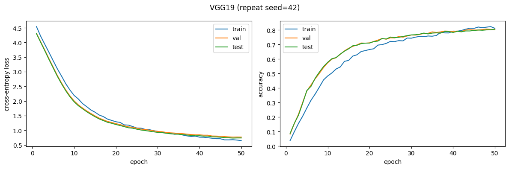
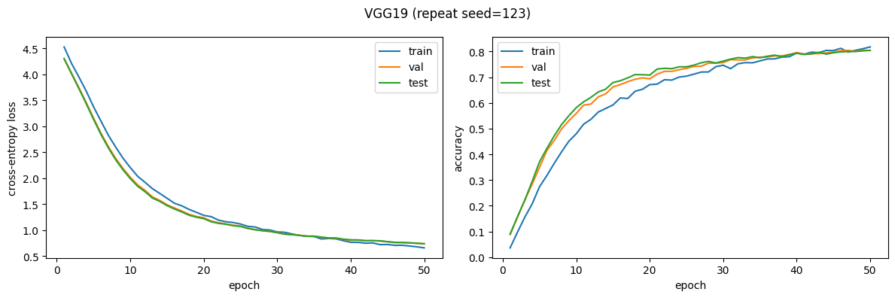
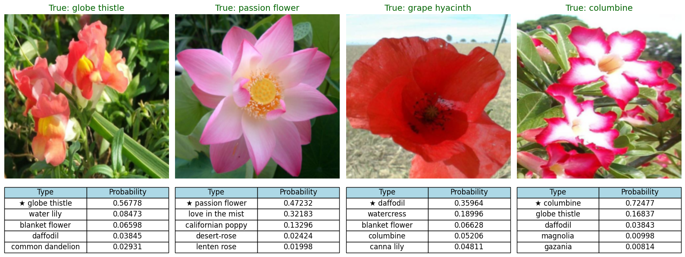

# Flower Classification with Pretrained CNNs

These notebooks use VGG19 and YOLOv5 to classify flower types from the Oxford Flowers-102 dataset.

[YOLOv5 colab notebook link](https://colab.research.google.com/drive/1RdoSitloXBsuMJMJRj4gJ9CMuGvUFAbI)

## Assignment Requirements Checklist

✅ **1. Python Implementation**: Entire codebase written in Python 3

✅ **2. PyTorch Framework**: Using PyTorch and torchvision for all models

✅ **3. Required Models**:
   - VGG19 (pretrained on ImageNet, transfer learning with frozen features)
   - YOLOv5s-cls (pretrained classification model, fine-tuned)

✅ **4. Dataset**: Oxford Flowers-102 dataset from https://www.robots.ox.ac.uk/~vgg/data/flowers/102/
   - 8,189 images across 102 flower categories

✅ **5. Additional Images**: Can be added by extending the dataset preparation functions, we decided not to add them

✅ **6. Data Split & Repetition**:
   - 50% training (4,094 images)
   - 25% validation (2,047 images) for hyperparameter tuning
   - 25% test (2,048 images)
   - **Two random splits** with different seeds: 42 and 123
   - Stratified splitting ensures balanced class distribution

✅ **7. Preprocessing Details**: Detailed description provided in dedicated section below

✅ **8. Network Architecture**: Detailed layer-by-layer descriptions provided for both VGG19 and YOLOv5

✅ **9. Visualization**:
   - Accuracy graphs (train/val/test) vs epochs
   - Cross-Entropy loss graphs (train/val/test) vs epochs
   - Generated for all models and both random splits

✅ **10. Accuracy Target**: Both VGG19 and YOLOv5s-cls typically achieves >70% test accuracy on Flowers-102

### Probabilistic Outputs
Both models produce probabilistic outputs using **softmax** function on final logits, providing probability distributions over all 102 flower classes.

---

## YOLOv5 notebook description

### DATA PREPROCESSING

The preprocessing consists of two stages: Physical Organization and Input Transformation.

A. Physical Data Organization (prepare_dataset function):
   1. Download: Fetches '102flowers.tgz' (images) and 'imagelabels.mat' (labels).
   2. Randomized Stratified Split: We did a Stratified Random Split to divide the data into 50% Train, 25% Validation, and 25% Test.
      - 'Stratified' ensures every flower category is represented in every split.
   3. Repetition: To ensure robustness, we repeated the entire splitting and training process twice using different random seeds.
                  This created two completely different random arrangements of the data to verify that the model's accuracy is stable and not due to a lucky split.
   4. Restructuring: Copies images into class-specific folders (required by PyTorch ImageFolder):
      datasets/flowers102_<run_name>/[train|val|test]/[class_id]/image.jpg

B. Input Transformation (On-the-Fly transforms):
   1. Training (Augmentation):
      - RandomResizedCrop(224): Randomly crops and scales part of the image. Forces model to learn parts.
      - RandomHorizontalFlip: Makes model invariant to direction.
      - ToTensor & Normalize: Converts to [0,1] tensor and standardizes using ImageNet mean/std.
   2. Validation/Test:
      - Resize(256) -> CenterCrop(224): Deterministic sizing for consistent evaluation.

### Detailed Network Architecture (YOLOv5s-cls) — *Classification model*

This notebook uses **YOLOv5s-cls** for **image classification** (not object detection). It follows the common transfer-learning setup: a pretrained **backbone** extracts features, then a **classification head** predicts one of 102 flower classes.

#### 1) Input
- Each image is preprocessed to shape $(B, 3, 224, 224)$.

#### 2) Backbone (feature extractor)
- A stack of convolutional blocks turns pixels into higher-level features (edges → textures → parts).
- YOLOv5-style backbones include CSP/C3 blocks and an SPPF-style layer to combine information across scales.

#### 3) Head (102 classes)
- Global average pooling + flatten produce a feature vector per image.
- The final linear layer is replaced to output **102 logits**: shape $(B, 102)$.

#### 4) Probabilities
- **Training:** `CrossEntropyLoss` takes logits directly.
- **Inference:** `softmax(logits)` converts them into class probabilities that sum to 1.

### Results

This section shows the YOLOv5s-cls classification results. It includes the training curves and a few example predictions.

**Full run outputs:**
- Run 1 (seed 42): [results/yolov5/run1.pdf](results/yolov5/run1.pdf)
- Run 2 (seed 123): [results/yolov5/run2.pdf](results/yolov5/run2.pdf)

#### Run 1 (Seed 42)

**Figure (Run 1 curves):** Accuracy goes up fast in the first few epochs because we start from pretrained weights, then it levels off. Loss goes down over time. By Epoch 20 the model reaches **Train Acc = 0.9629**, **Val Acc = 0.9541**, **Test Acc = 0.9497**. Validation and test stay close to training, so overfitting looks small.

#### Run 2 (Seed 123)

**Figure (Run 2 curves):** This run looks very similar to Run 1. By Epoch 20 the model reaches **Train Acc = 0.9592**, **Val Acc = 0.9521**, **Test Acc = 0.9502**. The gap between training and validation is small, which is a good sign.

#### Stability Across Splits (Run 1 vs Run 2)

**Figure (comparison):** The two runs follow almost the same pattern across epochs. Final test accuracy is about **0.95** in both runs, so the result is **stable** and not just from a “lucky” split.

#### Probabilistic Output (Random Prediction Simulations)

**Conclusions (from the three simulations):** These examples show the required probabilistic output (top classes with softmax probabilities). When the top probability is high, the model is usually confident. When probabilities are spread out, the image is often harder or the flower looks similar to other classes. The two runs usually pick the same top class, which matches the stability we see in the plots.

**Files used in this section:**
- Plots: [results/yolov5/run1.png](results/yolov5/run1.png), [results/yolov5/run2.png](results/yolov5/run2.png), [results/yolov5/comparison.png](results/yolov5/comparison.png)
- Simulations: [results/yolov5/pred.png](results/yolov5/pred.png), [results/yolov5/pred2.png](results/yolov5/pred2.png), [results/yolov5/pred3.png](results/yolov5/pred3.png)

---

## VGG19 notebook description

### DATA PREPROCESSING

#### Preprocessing of the Input Images

All images are resized to 224×224 pixels to match the VGG19 input size. During training, random horizontal flipping is applied as data augmentation. Images are converted to tensors and normalized using ImageNet mean and standard deviation values. The dataset is split into training, validation, and test sets using stratified sampling to preserve class distributions.

### Detailed Network Description (VGG19)

The model is based on VGG19, a 19-layer deep convolutional neural network pretrained on the ImageNet dataset (1,000 classes). Transfer learning is applied by freezing the pretrained feature extraction layers and training only the final classification layer for the Flowers-102 task.

#### Feature Extraction Layers (Frozen – Pretrained on ImageNet)

The feature extractor consists of five convolutional blocks, each using 3×3 convolutional filters with ReLU activation, followed by max-pooling layers:

**Block 1**
* Conv2D (64 filters, 3×3, ReLU)
* Conv2D (64 filters, 3×3, ReLU)
* MaxPool2D (2×2)

**Block 2**
* Conv2D (128 filters, 3×3, ReLU)
* Conv2D (128 filters, 3×3, ReLU)
* MaxPool2D (2×2)

**Block 3**
* Conv2D (256 filters, 3×3, ReLU) × 4
* MaxPool2D (2×2)

**Block 4**
* Conv2D (512 filters, 3×3, ReLU) × 4
* MaxPool2D (2×2)

**Block 5**
* Conv2D (512 filters, 3×3, ReLU) × 4
* MaxPool2D (2×2)

In total, the network contains 16 convolutional layers, all of which are frozen during training.

**Classifier Layers**

The original VGG19 classifier is partially retained and adapted for the Flowers-102 dataset:
1. Linear (25088 → 4096) + ReLU + Dropout (0.5) — Frozen
2. Linear (4096 → 4096) + ReLU + Dropout (0.5) — Frozen
3. Linear (4096 → 102) — Trainable

The final fully connected layer is replaced to output layer for the 102 flower classes.

#### Transfer Learning Strategy
* **Frozen layers**: All convolutional layers and the first two fully connected layers
* **Trainable layers**: Only the final classification layer
* **Output**: 102 class logits, converted to probabilities using the softmax function during inference

This strategy preserves pretrained visual representations while adapting the model efficiently to the target classification task.

#### Training Configuration
* **Input**: Images resized ro 224x224
* **Batch size**: 32
* **Epochs**: 50
* **Optimizer**: SGD
  * Learning rate = 1e-4
  * Momentum = 0.9
  * Weight decay = 1e-4
  * Nesterov = True
* **Loss**: Cross-entropy
* **Regularization**:
  * Dropout 0.5 before classifier
  * Weight decay (L2)

### Results
Training and validation performance of the VGG19 model under two different random seeds (seed = 123 and seed = 42). The left panels show the cross-entropy loss over 50 training epochs, and the right panels show the corresponding accuracy curves. Blue lines represent training performance, orange lines represent validation performance and the red dashed line indicates the final test set result.

**Full run outputs:**
- Run 1 (seed 42): [results/vgg19/run1.pdf](results/vgg19/run1.pdf)
- Run 2 (seed 123): [results/vgg19/run2.pdf](results/vgg19/run2.pdf)

#### Run 1 (Seed 42)

**Figure (Run 1 curves):** The training and validation curves for the VGG19 model with random seed 42 show stable convergence over 50 epochs. Cross-entropy loss decreases overall for both training and validation, with small fluctuations in later epochs; accuracy rises quickly early on and then largely plateaus with minor oscillations. The gap between training and validation stays relatively small, suggesting limited overfitting and good generalization performance.

By Epoch 50 the model reaches: 

**Train Acc = 0.8117**, **Val Acc = 0.8017**, **Test Acc = 0.8062**.

The final validation accuracy closely matches the final test accuracy (red dashed line), suggesting that the validation performance is a reliable indicator of generalization. Overall, the model exhibits stable learning dynamics and robust performance under this initialization.

#### Run 2 (Seed 123)

**Figure (Run 2 curves):** For the model trained with random seed 123, a similar convergence pattern is observed. Both training and validation loss decrease overall (not strictly monotonically), and accuracy increases early on and then levels off with small fluctuations.

By Epoch 50 the model reaches: 

**Train Acc = 0.8175**, **Val Acc = 0.8036**, **Test Acc = 0.8042**.

Slight variations appear in the early training phase compared to seed 42, mainly in the rate of improvement; however, the final performance remains comparable.
As with the previous run, the final validation accuracy aligns closely with the final test accuracy, demonstrating consistent generalization behavior. These results confirm that the model’s performance is reproducible and not strongly dependent on the choice of random seed.

#### Probabilistic Output (Random Prediction Simulations)

**Conclusions (from the simulations):** The model correctly identifies globe thistle and columbine but shows lower confidence and more dispersed probabilities. Passion flower exhibits increased uncertainty, and grape hyacinth is misclassified, indicating difficulty in distinguishing visually similar flower classes.

**Files used in this section:**
- Plots: [results/vgg19/run1.png](results/vgg19/run1.png), [results/vgg19/run2.png](results/vgg19/run2.png)
- Simulations: [results/vgg19/pred.png](results/vgg19/pred.png)

